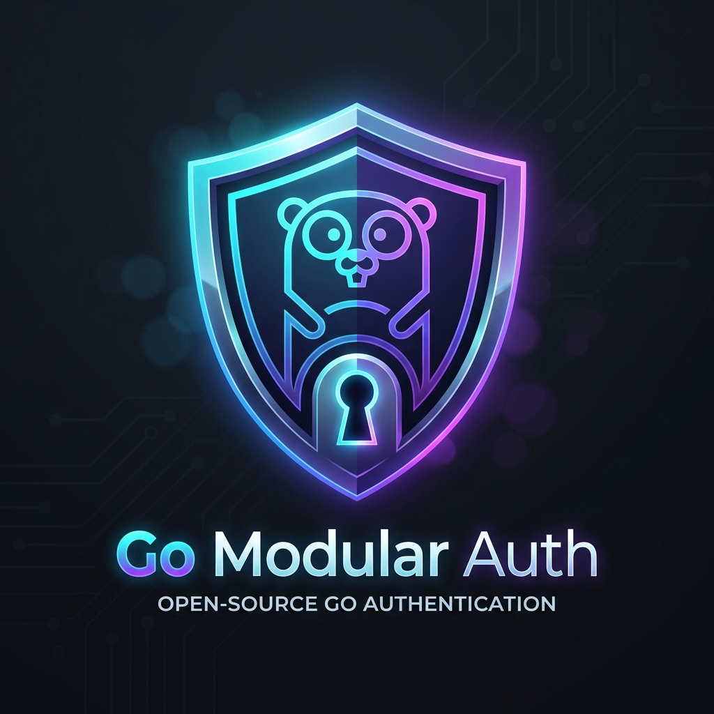

<p align="center">
  
</p>

<h1 align="center">Go Modular Auth</h1>

<p align="center">
  <strong>A modular, reactive, extensible, and strongly typed authentication framework for Go (Golang).</strong>
</p>

<p align="center">
  <a href="https://pkg.go.dev/github.com/BladiCreator/go-modular-auth"></a>
  <a href="https://goreportcard.com/report/github.com/BladiCreator/go-modular-auth"></a>
  <a href="https://github.com/BladiCreator/go-modular-auth/blob/main/LICENSE"></a>
  <a href="https://golang.org/"></a>
</p>

---

## 🌟 Overview

**Go Modular Auth** is a decoupled authentication engine designed to provide maximum flexibility and developer ergonomics in Go applications. Inspired by modular architectures such as *Better-Auth*, it allows developers to compose authentication systems from independent plugins (`emailpassword`, `twofactor`, OAuth2, etc.) without locking the project into any specific web framework (compatible with **Gin**, **Fiber**, **Echo**, **Chi**, **net/http**, or **gRPC**).

---

## 🚀 Key Features

- 🧩 **100% Modular Plugin-Based Architecture**: Add or remove authentication capabilities based on project requirements.
- ⚡ **Strong Typing with Generics (Go 1.18+)**: Safe access to individual plugin APIs with full IDE autocomplete and no manual casting via `auth.Plugin[emailpassword.Plugin](app)`.
- 📦 **Mutable Parameters Pattern (`Params.Extra`)**: Allows plugins and EventBus interceptors to dynamically enrich request parameters (`Set`/`Get`) before database persistence.
- 📢 **Integrated Reactive EventBus**: Subscribe to lifecycle hooks (`emailpassword.EventSignUpBefore`, `emailpassword.EventSignUpAfter`, etc.) to mutate payloads in-flight, send asynchronous emails, or audit user access.
- 🔐 **Production-Grade Security**: Strong password hashing using `bcrypt`, cryptographically secure token generation via `crypto/rand`, and 2FA TOTP (RFC 6238).
- 🗄️ **Decoupled Storage**: Connect any database (**PostgreSQL**, **MySQL**, **SQLite**, **MongoDB**, **Redis**, **GORM**) through clean repository interfaces. Includes a built-in thread-safe in-memory store.

---

## 📦 Installation

```bash
go get github.com/BladiCreator/go-modular-auth
```

---

## 💡 Production Example

The following complete example demonstrates user registration with dynamic parameter interception, lifecycle audit event subscription, user sign-in, 2FA TOTP secret generation, and TOTP code verification:

```go
package main

import (
	"context"
	"fmt"
	"log"

	"github.com/BladiCreator/go-modular-auth/adapters/memory"
	"github.com/BladiCreator/go-modular-auth/auth"
	"github.com/BladiCreator/go-modular-auth/config"
	"github.com/BladiCreator/go-modular-auth/domain/dto"
	"github.com/BladiCreator/go-modular-auth/plugins"
	"github.com/BladiCreator/go-modular-auth/plugins/emailpassword"
	"github.com/BladiCreator/go-modular-auth/plugins/twofactor"
)

func main() {
	ctx := context.Background()

	// Storage adapter (in-memory store for this example)
	storage := memory.New()

	// 1. Initialize engine with configuration and plugins
	app, err := auth.New(
		config.WithBcryptCost(12),
		config.WithPlugins(
			plugins.EmailPassword(storage, emailpassword.WithMinPasswordLength(8)),
			plugins.TwoFactor(storage, twofactor.WithIssuer("Enterprise ERP")),
		),
	)
	if err != nil {
		log.Fatalf("Failed to initialize Auth: %v", err)
	}

	// 2. Intercept registration to attach dynamic metadata (e.g. Roles, Organizations)
	app.Events().Subscribe(emailpassword.EventSignUpBefore, func(c context.Context, payload *emailpassword.SignUpEventPayload) {
		payload.Params.Set("role", "admin")
		payload.Params.Set("org_id", "org_123")
	})

	// 3. Subscribe to post-action EventBus notifications
	app.Events().Subscribe(emailpassword.EventSignUpAfter, func(c context.Context, payload *emailpassword.SignUpEventPayload) {
		role, _ := payload.Params.Get("role")
		log.Printf("📧 [EVENT] Sending welcome email to: %s (Role: %v)", payload.User.Email, role)
	})

	app.Events().Subscribe(emailpassword.EventSignInAfter, func(c context.Context, payload *emailpassword.SignInEventPayload) {
		log.Printf("🛡️ [AUDIT] Successful sign-in - User ID: %s | Email: %s", payload.User.ID, payload.User.Email)
	})

	// 4. Flow 1: User Registration
	fmt.Println("--- 1. User Registration ---")
	newUser, err := auth.Plugin[emailpassword.Plugin](app).SignUp(ctx, dto.SignUpParams{
		Name:     "Carlos Mendoza",
		Email:    "carlos@enterprise.com",
		Password: "SuperSecurePassword123!",
	})
	if err != nil {
		log.Fatalf("Sign up failed: %v", err)
	}
	fmt.Printf("✔ Registered User: %s (ID: %s)\n\n", newUser.Name, newUser.ID)

	// 5. Flow 2: User Sign-In
	fmt.Println("--- 2. User Sign-In ---")
	signedInUser, err := auth.Plugin[emailpassword.Plugin](app).SignIn(ctx, dto.SignInParams{
		Email:    "carlos@enterprise.com",
		Password: "SuperSecurePassword123!",
	})
	if err != nil {
		log.Fatalf("Sign in failed: %v", err)
	}
	fmt.Printf("✔ Successfully authenticated as: %s (ID: %s)\n\n", signedInUser.Email, signedInUser.ID)

	// 6. Flow 3: 2FA TOTP Configuration
	fmt.Println("--- 3. 2FA TOTP Setup ---")
	otpURI, err := auth.Plugin[twofactor.Plugin](app).GenerateTOTPSecret(ctx, newUser.ID)
	if err != nil {
		log.Fatalf("Failed to generate 2FA: %v", err)
	}
	fmt.Printf("✔ Authenticator App URI: %s\n\n", otpURI)

	// 7. Flow 4: 2FA Code Verification
	fmt.Println("--- 4. 2FA Code Verification ---")
	valid, err := auth.Plugin[twofactor.Plugin](app).VerifyCode(ctx, newUser.ID, "123456")
	if err != nil || !valid {
		fmt.Println("❌ Invalid 2FA code")
	} else {
		fmt.Println("✔ 2FA code successfully verified")
	}
}
```

---

## 🗄️ Custom Repository Implementation (GORM + PostgreSQL)

In production applications, user records and sessions are persisted to a relational or document database. Implement the repository interfaces required by each plugin to use your database of choice.

### 1. Database Table / Schema Definition with GORM

```go
package store

import (
	"context"
	"errors"
	"time"

	"github.com/BladiCreator/go-modular-auth/domain"
	"github.com/BladiCreator/go-modular-auth/domain/dto"
	"github.com/BladiCreator/go-modular-auth/domain/entity"
	"github.com/BladiCreator/go-modular-auth/plugins/emailpassword"
	"github.com/BladiCreator/go-modular-auth/plugins/twofactor"
	"github.com/google/uuid"
	"gorm.io/gorm"
)

// Compile-time interface checks
var (
	_ emailpassword.Repository = (*GormAuthRepository)(nil)
	_ twofactor.Repository     = (*GormAuthRepository)(nil)
)

// ORM Models for GORM
type UserModel struct {
	ID            string    `gorm:"primaryKey;type:uuid"`
	Name          string    `gorm:"not null"`
	Email         string    `gorm:"uniqueIndex;not null"`
	PasswordHash  string    `gorm:"not null"`
	EmailVerified bool      `gorm:"default:false"`
	TOTPSecret    string    `gorm:"default:''"`
	CreatedAt     time.Time
	UpdatedAt     time.Time
}

type TwoFactorModel struct {
	ID          string     `gorm:"primaryKey;type:uuid"`
	UserID      string     `gorm:"uniqueIndex;not null"`
	Secret      string     `gorm:"not null"`
	BackupCodes string     `gorm:"type:text"`
	Verified    bool       `gorm:"default:false"`
	Failures    int        `gorm:"default:0"`
	LockedUntil *time.Time
	CreatedAt   time.Time
	UpdatedAt   time.Time
}

type OTPChallengeModel struct {
	Key       string    `gorm:"primaryKey"`
	UserID    string    `gorm:"index;not null"`
	CodeHash  string    `gorm:"not null"`
	Attempts  int       `gorm:"default:0"`
	ExpiresAt time.Time `gorm:"index"`
}

// Main Repository Struct
type GormAuthRepository struct {
	db *gorm.DB
}

func NewGormAuthRepository(db *gorm.DB) *GormAuthRepository {
	// AutoMigrate creates tables automatically in PostgreSQL / MySQL / SQLite
	_ = db.AutoMigrate(&UserModel{}, &SessionModel{}, &TwoFactorModel{}, &OTPChallengeModel{})
	return &GormAuthRepository{db: db}
}

// --- emailpassword.Repository Methods ---

func (r *GormAuthRepository) CreateUser(ctx context.Context, params *dto.CreateUserParams) (*entity.User, error) {
	model := UserModel{
		ID:           uuid.New().String(),
		Name:         params.Name,
		Email:        params.Email,
		PasswordHash: params.PasswordHash,
		CreatedAt:    time.Now(),
		UpdatedAt:    time.Now(),
	}
	if err := r.db.WithContext(ctx).Create(&model).Error; err != nil {
		return nil, err
	}
	return toUserEntity(&model), nil
}

func (r *GormAuthRepository) GetUserByEmail(ctx context.Context, email string) (*entity.User, error) {
	var model UserModel
	err := r.db.WithContext(ctx).Where("email = ?", email).First(&model).Error
	if errors.Is(err, gorm.ErrRecordNotFound) {
		return nil, domain.ErrUserNotFound
	}
	return toUserEntity(&model), err
}

func (r *GormAuthRepository) GetUserByID(ctx context.Context, id string) (*entity.User, error) {
	var model UserModel
	err := r.db.WithContext(ctx).Where("id = ?", id).First(&model).Error
	if errors.Is(err, gorm.ErrRecordNotFound) {
		return nil, domain.ErrUserNotFound
	}
	return toUserEntity(&model), err
}

func (r *GormAuthRepository) CreateSession(ctx context.Context, s *dto.CreateSessionParams) (*entity.Session, error) {
	model := SessionModel{
		ID:        uuid.New().String(),
		UserID:    s.UserID,
		Token:     s.Token,
		IPAddress: s.IPAddress,
		UserAgent: s.UserAgent,
		ExpiresAt: s.ExpiresAt,
		CreatedAt: s.CreatedAt,
	}
	if err := r.db.WithContext(ctx).Create(&model).Error; err != nil {
		return nil, err
	}
	return toSessionEntity(&model), nil
}

func (r *GormAuthRepository) GetSessionByToken(ctx context.Context, token string) (*entity.Session, error) {
	var model SessionModel
	err := r.db.WithContext(ctx).Where("token = ?", token).First(&model).Error
	if errors.Is(err, gorm.ErrRecordNotFound) {
		return nil, domain.ErrSessionNotFound
	}
	return toSessionEntity(&model), err
}

func (r *GormAuthRepository) DeleteSession(ctx context.Context, token string) error {
	return r.db.WithContext(ctx).Where("token = ?", token).Delete(&SessionModel{}).Error
}

// --- twofactor.Repository Methods ---

func (r *GormAuthRepository) FindByUserID(ctx context.Context, userID string) (*twofactor.TwoFactor, error) {
	var model TwoFactorModel
	err := r.db.WithContext(ctx).Where("user_id = ?", userID).First(&model).Error
	if errors.Is(err, gorm.ErrRecordNotFound) {
		return nil, twofactor.ErrTwoFactorNotEnabled
	}
	return &twofactor.TwoFactor{
		ID:          model.ID,
		UserID:      model.UserID,
		Secret:      model.Secret,
		BackupCodes: model.BackupCodes,
		Verified:    model.Verified,
		Failures:    model.Failures,
		LockedUntil: model.LockedUntil,
		CreatedAt:   model.CreatedAt,
		UpdatedAt:   model.UpdatedAt,
	}, err
}

func (r *GormAuthRepository) Create(ctx context.Context, tf *twofactor.TwoFactor) error {
	model := TwoFactorModel{
		ID:          uuid.New().String(),
		UserID:      tf.UserID,
		Secret:      tf.Secret,
		BackupCodes: tf.BackupCodes,
		Verified:    tf.Verified,
		Failures:    tf.Failures,
		LockedUntil: tf.LockedUntil,
		CreatedAt:   time.Now(),
		UpdatedAt:   time.Now(),
	}
	return r.db.WithContext(ctx).Create(&model).Error
}

func (r *GormAuthRepository) Update(ctx context.Context, tf *twofactor.TwoFactor) error {
	return r.db.WithContext(ctx).Model(&TwoFactorModel{}).Where("user_id = ?", tf.UserID).Updates(map[string]any{
		"secret":       tf.Secret,
		"backup_codes": tf.BackupCodes,
		"verified":     tf.Verified,
		"failures":     tf.Failures,
		"locked_until": tf.LockedUntil,
		"updated_at":   time.Now(),
	}).Error
}

func (r *GormAuthRepository) DeleteByUserID(ctx context.Context, userID string) error {
	return r.db.WithContext(ctx).Where("user_id = ?", userID).Delete(&TwoFactorModel{}).Error
}

func (r *GormAuthRepository) SaveOTPChallenge(ctx context.Context, challenge *twofactor.OTPChallenge) error {
	model := OTPChallengeModel{
		Key:       challenge.Key,
		UserID:    challenge.UserID,
		CodeHash:  challenge.CodeHash,
		Attempts:  challenge.Attempts,
		ExpiresAt: challenge.ExpiresAt,
	}
	return r.db.WithContext(ctx).Save(&model).Error
}

func (r *GormAuthRepository) GetOTPChallenge(ctx context.Context, key string) (*twofactor.OTPChallenge, error) {
	var model OTPChallengeModel
	err := r.db.WithContext(ctx).Where("key = ?", key).First(&model).Error
	if errors.Is(err, gorm.ErrRecordNotFound) {
		return nil, twofactor.ErrOTPExpired
	}
	return &twofactor.OTPChallenge{
		Key:       model.Key,
		UserID:    model.UserID,
		CodeHash:  model.CodeHash,
		Attempts:  model.Attempts,
		ExpiresAt: model.ExpiresAt,
	}, err
}

func (r *GormAuthRepository) DeleteOTPChallenge(ctx context.Context, key string) error {
	return r.db.WithContext(ctx).Where("key = ?", key).Delete(&OTPChallengeModel{}).Error
}

// Entity mapping helpers
func toUserEntity(m *UserModel) *entity.User {
	return &entity.User{
		ID:            m.ID,
		Name:          m.Name,
		Email:         m.Email,
		PasswordHash:  m.PasswordHash,
		EmailVerified: m.EmailVerified,
		CreatedAt:     m.CreatedAt,
		UpdatedAt:     m.UpdatedAt,
	}
}

func toSessionEntity(m *SessionModel) *entity.Session {
	return &entity.Session{
		ID:        m.ID,
		UserID:    m.UserID,
		Token:     m.Token,
		ExpiresAt: m.ExpiresAt,
		CreatedAt: m.CreatedAt,
		IPAddress: m.IPAddress,
		UserAgent: m.UserAgent,
	}
}
```

---

## 📢 Advanced EventBus and Mutable Parameters Patterns

The decoupled EventBus allows intercepting and modifying in-flight parameters during registration or reacting asynchronously after actions complete.

### 1. Registration Parameter Interception (`Params.Set`)
```go
app.Events().Subscribe(emailpassword.EventSignUpBefore, func(ctx context.Context, payload *emailpassword.SignUpEventPayload) {
    // Attach dynamic plugin metadata (e.g. initial Organization ID or Role)
    payload.Params.Set("organization_id", "org_987")
    payload.Params.Set("role", "member")
})
```

### 2. Asynchronous Welcome Emails
```go
app.Events().Subscribe(emailpassword.EventSignUpAfter, func(ctx context.Context, payload *emailpassword.SignUpEventPayload) {
    // Execute inside a goroutine to avoid blocking the HTTP response
    go func(user *entity.User) {
        mailer.SendWelcomeEmail(user.Email, user.Name)
    }(payload.User)
})
```

### 3. Security Audit Logging on Sign-In
```go
app.Events().Subscribe(emailpassword.EventSignInAfter, func(ctx context.Context, payload *emailpassword.SignInEventPayload) {
    securityLogger.Info("Successful sign-in", "userID", payload.User.ID, "email", payload.User.Email)
})
```

---

## 🔌 Complete Plugin Reference

### 📧 Plugin `emailpassword`
Handles credential-based registration, authentication, password management, and password resets.

- **Constructor**: `plugins.EmailPassword(repo, opts...)`
- **Configuration Options**:
  - `emailpassword.WithMinPasswordLength(minLen int)` (default: `8`)
  - `emailpassword.WithRequireEmailVerification(require bool)` (default: `false`)
  - `emailpassword.WithResetTokenExpiry(duration time.Duration)` (default: `1 hour`)
- **Published Events**:
  - `emailpassword.EventSignUpBefore` → `(ctx context.Context, payload *emailpassword.SignUpEventPayload)` (contains `Params *dto.CreateUserParams`)
  - `emailpassword.EventSignUpAfter` → `(ctx context.Context, payload *emailpassword.SignUpEventPayload)` (contains `Params` and `User *entity.User`)
  - `emailpassword.EventSignInBefore` → `(ctx context.Context, payload *emailpassword.SignInEventPayload)` (contains `User *entity.User`)
  - `emailpassword.EventSignInAfter` → `(ctx context.Context, payload *emailpassword.SignInEventPayload)` (contains `User *entity.User`)
  - `emailpassword.EventPasswordChangeBefore` / `After` → `(ctx context.Context, payload *emailpassword.PasswordChangeEventPayload)`
  - `emailpassword.EventPasswordResetRequested` → `(ctx context.Context, payload *emailpassword.PasswordResetRequestedEventPayload)`
  - `emailpassword.EventPasswordResetCompleted` → `(ctx context.Context, payload *emailpassword.PasswordResetCompletedEventPayload)`

---

### 🔐 Plugin `twofactor`
Handles Two-Factor Authentication via Time-based One-Time Passwords (TOTP RFC 6238).

- **Constructor**: `plugins.TwoFactor(repo, opts...)`
- **Configuration Options**:
  - `twofactor.WithIssuer(issuer string)` (default: `"Auth"`)
- **Published Events**:
  - `twofactor.EventTOTPGenerated` → `(ctx context.Context, payload *twofactor.TOTPGeneratedEventPayload)`

---

## 📄 License

This project is licensed under the **MIT License**. See the [LICENSE](LICENSE) file for details.
